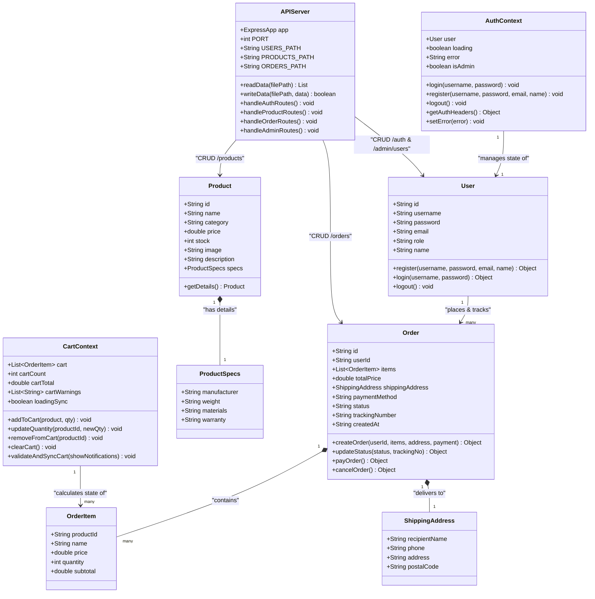
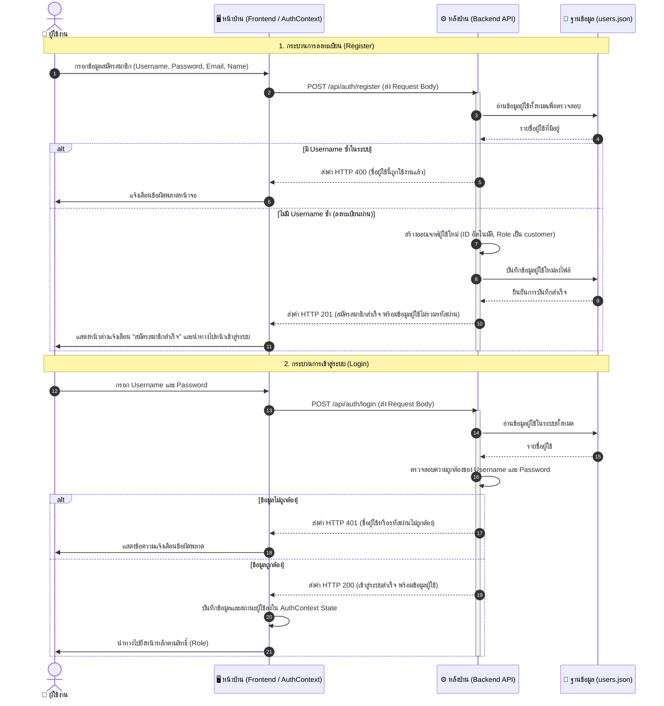
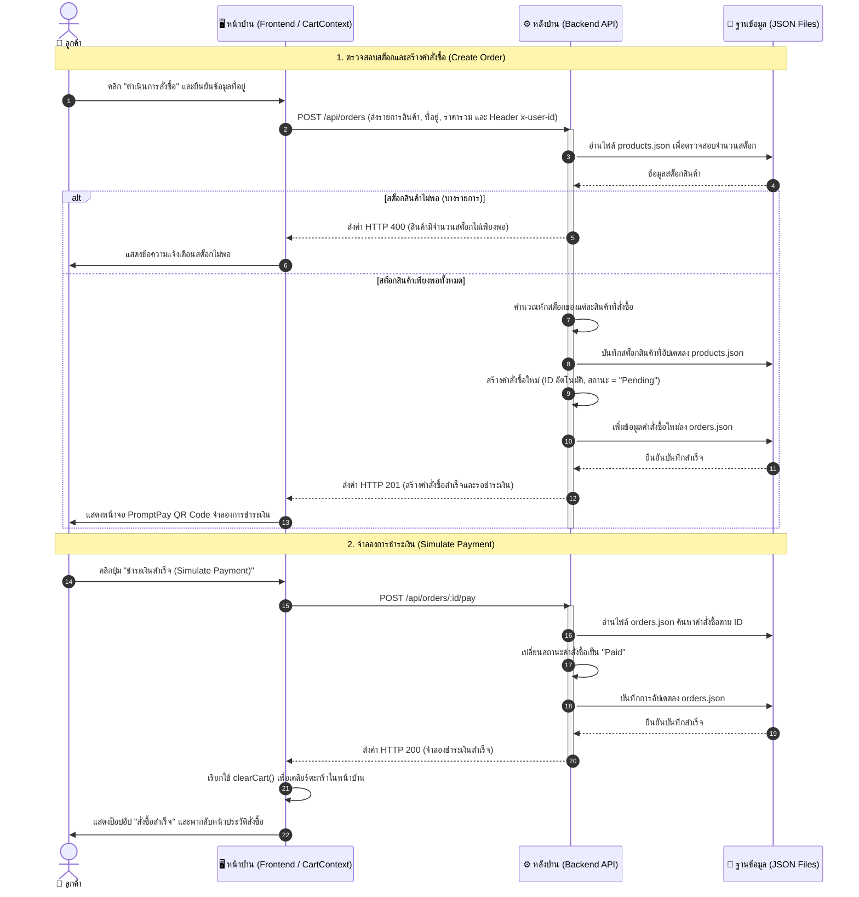
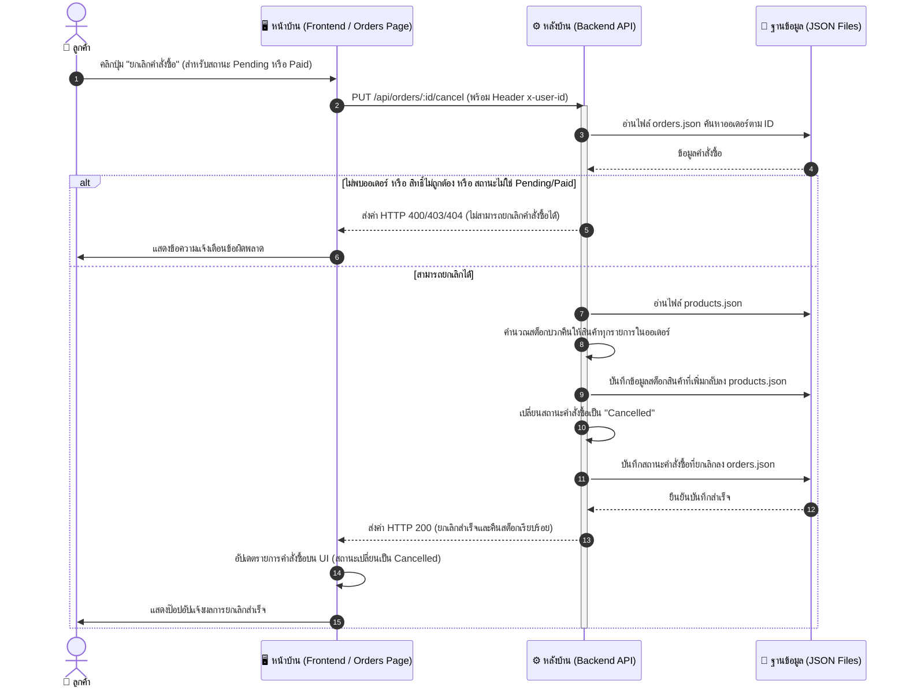
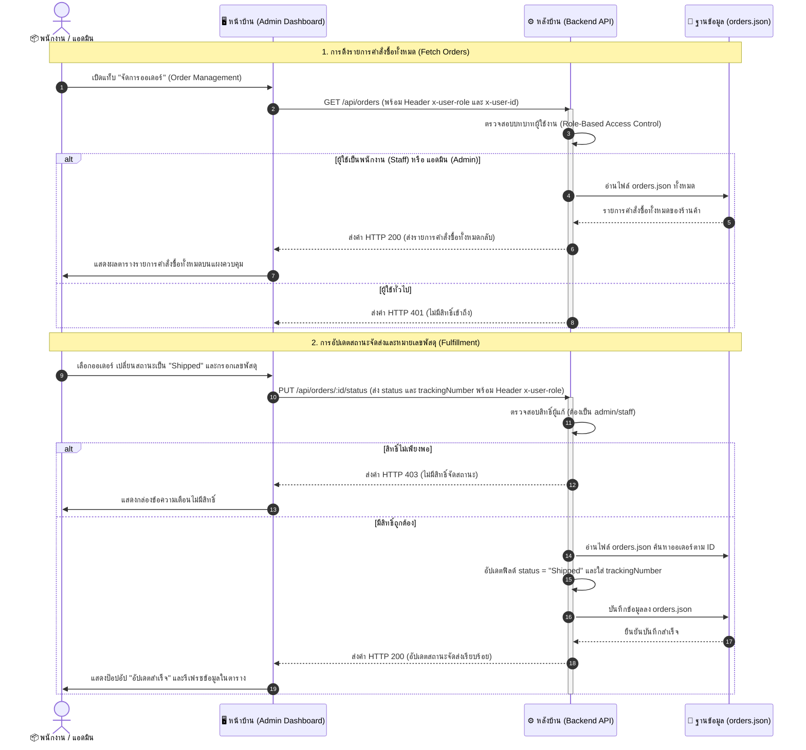
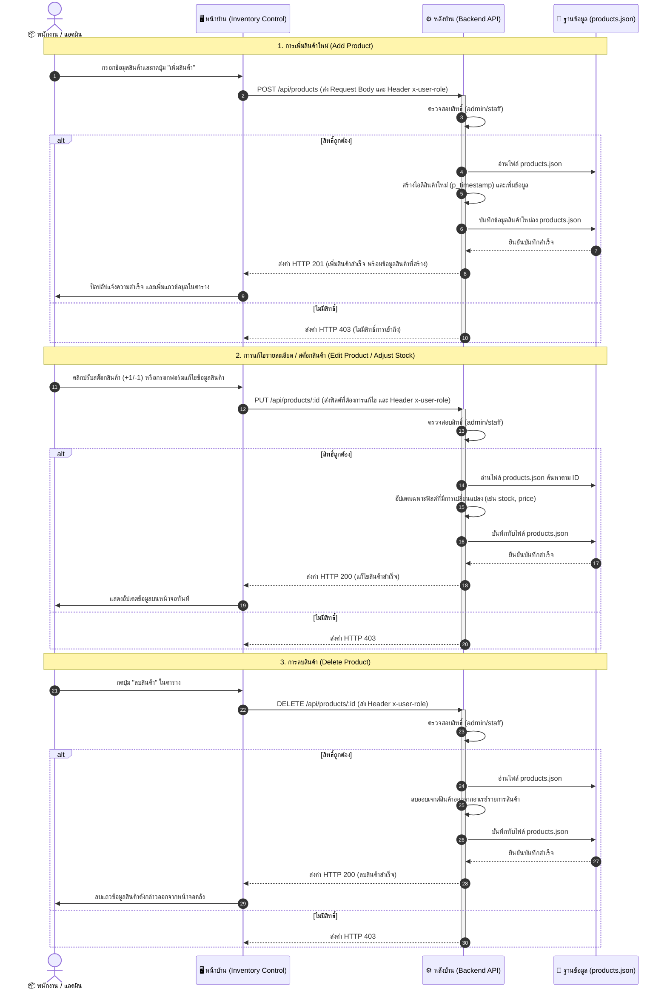
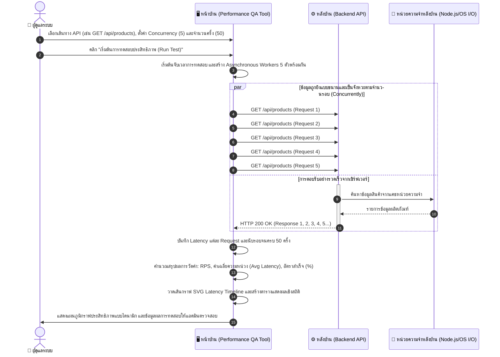

# เอกสารการออกแบบระบบ (System Design Document)
## ระบบร้านค้าเพื่อสุขภาพระดับพรีเมียม - fitpung


---

## วัตถุประสงค์ของระบบ (System Objectives)
- เพื่อพัฒนาเว็บไซต์ร้านขายอุปกรณ์เพื่อสุขภาพในรูปแบบพาณิชย์อิเล็กทรอนิกส์ (E-Commerce) ที่สามารถใช้งานได้อย่างมีประสิทธิภาพ
- เพื่ออำนวยความสะดวกให้ผู้ใช้งานสามารถค้นหาข้อมูล เลือกซื้อ และสั่งซื้ออุปกรณ์เพื่อสุขภาพผ่านระบบออนไลน์ได้อย่างรวดเร็ว
- เพื่อพัฒนาระบบจัดการข้อมูลสินค้า คำสั่งซื้อ และข้อมูลลูกค้าให้เป็นระบบและง่ายต่อการบริหารจัดการ

---
## ขอบเขตการให้บริการ (Service Scope)

**ลูกค้า (Customer)**
- สมัครสมาชิกและเข้าสู่ระบบใช้งาน
- เรียกดูและค้นหาสินค้าภายในเว็บไซต์
- ทำการสั่งซื้ออุปกรณ์ด้านสุขภาพผ่านช่องทางออนไลน์
- ตรวจสอบสถานะการจัดส่งสินค้า

**พนักงาน (Staff)**
- ดูแลปรับปรุงสถานะของสินค้าลูกค้า
- ดำเนินการเกี่ยวกับคำสั่งซื้อและตรวจสอบการชำระเงินของลูกค้า

**ผู้ดูแลระบบ (Administrator)**
- บริหารจัดการข้อมูลของสมาชิกในระบบ
- เรียกดูรายงานสรุปยอดขาย
- เพิ่มและลบสินค้าใหม่

---

## 1. บทบาทและความสำคัญของแผนภาพต่อการพัฒนาระบบ
ในการสร้างซอฟต์แวร์ การใช้แผนภาพต่างมุมมองช่วยให้ผู้พัฒนาระบบทำงานได้อย่างเป็นระบบและลดความผิดพลาด ดังนี้:

*   **Use Case Diagram:** เป็นตัวบอก **"ระบบนี้ทำอะไรได้บ้างและใครเป็นคนทำ"** ทำหน้าที่ระบุขอบเขตของระบบ (System Scope) และบทบาทผู้ใช้งาน (Actors) ช่วยไม่ให้ทีมงานหลงทิศทางหรือพัฒนาฟีเจอร์นอกขอบเขต
*   **Class Diagram:** เป็นตัวบอก **"โครงสร้างข้อมูลในระบบเชื่อมโยงกันอย่างไร"** ทำหน้าที่กำหนดชนิดตัวแปร ความสัมพันธ์ และเมธอดของออบเจกต์ข้อมูล ทำให้ฝั่งฐานข้อมูลและนักพัฒนาทุกส่วนเข้าใจฟิลด์และคีย์ตรงกัน
*   **Sequence Diagram:** เป็นตัวบอก **"ระบบคุยกันในแนวตั้งอย่างไรตามเวลา"** ทำหน้าที่แสดงการไหลของข้อความ (Message Flow) ระหว่างคอมโพเนนต์หน้าบ้าน หลังบ้าน และฐานข้อมูลเมื่อเกิดเหตุการณ์ใดเหตุการณ์หนึ่ง ทำให้การดีบักและการเขียน Logic สมเหตุสมผล
*   **Wireframe:** เป็นตัวบอก **"เค้าโครงหน้าตาเว็บจะถูกจัดวางอย่างไร"** เป็นโครงสร้างลายเส้นเพื่อกำหนดจุดวางปุ่ม แบนเนอร์ ช่องพิมพ์ข้อมูล เพื่อประเมินความลื่นไหลของหน้าจอก่อนจะลงสีหรือทำกราฟิกจริง
*   **Prototype (ต้นแบบ):** เป็นตัวบอก **"การทดสอบการใช้งานจริงมีปฏิสัมพันธ์อย่างไร"** เป็นตัวช่วยทดสอบความรู้สึกของผู้ใช้งาน (User Experience) และระบบฟังก์ชันต่างๆ ว่าสามารถคลิกโต้ตอบ ชำระเงิน หรือสลับสิทธิ์ผู้ใช้ได้สมบูรณ์ก่อนปล่อยใช้งานจริง

---

## 2. แผนภาพแสดงสิทธิ์การใช้งาน (Use Case Diagram)


## 3. แผนภาพแสดงโครงสร้างข้อมูล (Class Diagram)
แสดงโครงสร้างจำลองเชิงคลาส (Class Structure) ของระบบแอปพลิเคชันทั้งหมด ระบุดาต้าไทป์ ตัวแปร เมธอด และความสัมพันธ์ของคลาสหลังบ้านร่วมกับ API คอนโทรลเลอร์ ตลอดจนคลาสจัดเตรียมสถานะ (React Context) ของหน้าบ้าน



---

## 4. แผนภาพแสดงการไหลของข้อมูล (Sequence Diagram)
แสดงกระบวนการทำงานและการไหลของข้อมูลระหว่างผู้ใช้งาน หน้าบ้าน (Frontend) หลังบ้าน (Backend API) และไฟล์ฐานข้อมูล (JSON DB) ในระบบปัจจุบันทั้งหมด 6 กระบวนการหลัก ดังนี้:

### 4.1 กระบวนการลงทะเบียนและเข้าสู่ระบบ (Authentication Process)
แสดงขั้นตอนการสมัครสมาชิกและการตรวจสอบสิทธิ์เข้าสู่ระบบของลูกค้า/พนักงาน/ผู้ดูแลระบบ



### 4.2 กระบวนการสั่งซื้อและชำระเงินจำลอง (Ordering & Simulated Payment Process)
แสดงขั้นตอนการเลือกสั่งซื้อสินค้า ตรวจสอบสต็อก การหักสต็อก และการจำลองชำระเงินผ่าน PromptPay QR Code



### 4.3 กระบวนการยกเลิกคำสั่งซื้อและการคืนคลังสินค้า (Order Cancellation & Inventory Restoration)
แสดงขั้นตอนที่ลูกค้ากดยกเลิกคำสั่งซื้อ โดยระบบต้องปรับสถานะเป็น Cancelled และคืนสินค้ากลับคลัง



### 4.4 กระบวนการจัดการคำสั่งซื้อและจัดส่งโดยพนักงาน (Order Management & Fulfillment Process)
แสดงขั้นตอนที่พนักงานหรือแอดมินเข้ามาดูรายการสั่งซื้อ ตรวจสอบ และอัปเดตสถานะการจัดส่งพร้อมหมายเลขพัสดุ (Tracking Number)



### 4.5 กระบวนการจัดการสินค้าและสต็อกหลังร้าน (Product Inventory CRUD Operations)
แสดงขั้นตอนที่ผู้ดูแลระบบ/พนักงานทำรายการเพิ่ม แก้ไขข้อมูล/ปรับสต็อก และลบสินค้าออกจากระบบ



### 4.6 กระบวนการทดสอบประสิทธิภาพ API (Performance QA Tester)
แสดงขั้นตอนการทำงานของโมดูลจำลองการโหลด API (API Load Tester) ที่ยิง Request แบบขนานเพื่อตรวจวัดความหน่วงของเซิร์ฟเวอร์หลังบ้าน



---

## 5. แผนผังต้นแบบลายเส้น (Wireframe - หน้าหลัก)
โครงร่างแสดงตำแหน่งการวางข้อมูลของหน้าร้านค้าออนไลน์หลักเพื่อความเรียบง่ายและเป็นระเบียบ

```text
+---------------------------------------------------------------------------------+
|  VITA LIFE                                          [ร้านค้า]  [ตะกร้า (0)]  [👤 สมชาย] |
+---------------------------------------------------------------------------------+
|                                                                                 |
|   ===================== VITALIFE WELLNESS =====================                 |
|   ยกระดับสุขภาพและการดำเนินชีวิตของคุณด้วยผลิตภัณฑ์พรีเมียมคัดสรรพิเศษเพื่อความสุข     |
|                                                                                 |
+---------------------------------------------------------------------------------+
|  [🔍 ค้นหาผลิตภัณฑ์สุขภาพ...]                                                      |
|                                                                                 |
|  ( ทั้งหมด )  ( อาหารเสริม )  ( อาหาร/เครื่องดื่ม )  ( อุปกรณ์ฟิตเนส )  ( ผลิตภัณฑ์ผิว )   |
+---------------------------------------------------------------------------------+
|  +--------------------+  +--------------------+  +--------------------+         |
|  | [Tag: Supplements] |  | [Tag: Organic Food]|  | [Tag: Fitness Gear]|         |
|  |                    |  |                    |  |                    |         |
|  |    [รูปเวย์โปรตีน]   |  |     [รูปผงมัทฉะ]    |  |    [รูปเสื่อโยคะ]    |         |
|  |                    |  |                    |  |                    |         |
|  | เวย์โปรตีนไอโซเลท...|  | ผงมัทฉะออร์แกนิก... |  | เสื่อโยคะยางพารา... |         |
|  | ✓ มีสินค้าในสต็อก    |  | ✓ มีสินค้าในสต็อก    |  | ⚠️ เหลือเพียง 2 ชิ้น |         |
|  | ราคา: 1,890 บาท    |  | ราคา: 690 บาท      |  | ราคา: 2,450 บาท    |         |
|  |     [ใส่ตะกร้า]     |  |     [ใส่ตะกร้า]     |  |     [ใส่ตะกร้า]     |         |
|  +--------------------+  +--------------------+  +--------------------+         |
+---------------------------------------------------------------------------------+
|  © 2026 VITALIFE E-Commerce Co., Ltd. All rights reserved.                      |
+---------------------------------------------------------------------------------+
```

---

## 6. ต้นแบบความละเอียดสูงเพื่อโต้ตอบ (High-Fidelity Interactive Prototype)
สำหรับระบบ fitpung ตัวโปรเจ็คโค้ดของหน้าบ้าน (React/Vite) และหลังบ้าน (Node.js/Express) ในปัจจุบันทำหน้าที่เป็น **High-Fidelity Prototype (ต้นแบบที่มีความเที่ยงตรงสูง)** ซึ่งมีคุณลักษณะการโต้ตอบที่ครบถ้วน ดังนี้:

*   **มีชีวิตจริงและสามารถใช้งานได้จริง (Working Code):** สามารถพิมพ์ค้นหา กรองหมวดหมู่สินค้า กดเพิ่มสินค้าเข้าสู่ตะกร้าสะสมยอด และคลิกเปิด Modal ชำระเงินเพื่อกรอกข้อมูลจัดส่งที่เชื่อมโยงกันได้จริง
*   **ผสานสไตล์และธีมความงามระดับลักชัวรี่:** แสดงผลด้วยสีสันที่ถูกกำหนดขึ้นจากดีไซน์เนอร์อย่างเป็นทางการ (สีเขียวป่ามรกตสว่างและแสงสะท้อนขอบสีทอง) นำเสนอภาพประกอบจริงจาก AI
*   **ระบบจำลองข้อมูลสมจริง:** แอดมินสามารถเพิ่มข้อมูลสินค้าสุขภาพเข้าไปในระบบเพื่อเทสพฤติกรรมของแอปพลิเคชันเสมือนอยู่บนระบบโปรดักชันจริงก่อนเปิดตัว

---

## 7. โครงสร้างข้อมูลที่รับผิดชอบโดยสมาชิกแต่ละคน (Data Schema by Team Member)


###  : ระบบสมาชิกและการเข้าสู่ระบบ (Auth & User)
**ไฟล์ฐานข้อมูล:** `backend/data/users.json`
```json
{
  "id": "String (เช่น u_1700000000000)",
  "username": "String (ชื่อผู้ใช้)",
  "password": "String (รหัสผ่าน)",
  "email": "String (อีเมล)",
  "role": "String ('admin', 'staff', 'customer')",
  "name": "String (ชื่อ-นามสกุลจริง)"
}
```

### : ระบบแสดงและค้นหาสินค้าหน้าบ้าน (Products)
**ไฟล์ฐานข้อมูล:** `backend/data/products.json`

```json
{
  "id": "String (เช่น p_1700000000000)",
  "name": "String (ชื่อสินค้า)",
  "category": "String (หมวดหมู่)",
  "price": "Number (ราคา)",
  "stock": "Number (จำนวนคงเหลือ)",
  "image": "String (URL รูปภาพ)",
  "description": "String (รายละเอียดสินค้า)",
  "specs": {
    "manufacturer": "String (ผู้ผลิต)",
    "weight": "String (น้ำหนัก)",
    "materials": "String (ส่วนประกอบ)",
    "warranty": "String (การรับรอง)"
  }
}
```

###  (Shopping Cart)
**การจัดเก็บ:** จัดเก็บผ่าน React Context (Frontend State) ไม่ลงฐานข้อมูลจนกว่าจะชำระเงิน
**โครงสร้าง Schema (CartItem):**
```json
{
  "productId": "String (อ้างอิงรหัสสินค้า)",
  "name": "String (ชื่อสินค้า)",
  "price": "Number (ราคาต่อชิ้น)",
  "quantity": "Number (จำนวนที่ต้องการสั่ง)",
  "subtotal": "Number (ราคารวมของสินค้านี้)"
}
```

###  ระบบคำสั่งซื้อและการชำระเงิน (Orders)
**ไฟล์ฐานข้อมูล:** `backend/data/orders.json`

```json
{
  "id": "String (เช่น ord_1700000000000)",
  "userId": "String (อ้างอิงรหัสผู้ซื้อจากคนที่ 1)",
  "items": "[CartItem] (รายการสินค้าที่สั่งซื้อจากตะกร้าคนที่ 3)",
  "totalPrice": "Number (ราคารวมทั้งหมด)",
  "shippingAddress": {
    "recipientName": "String",
    "phone": "String",
    "address": "String",
    "postalCode": "String"
  },
  "paymentMethod": "String (เช่น 'PromptPay')",
  "status": "String ('Pending', 'Paid', 'Shipped', 'Delivered', 'Cancelled')",
  "trackingNumber": "String (เลขพัสดุ - จะถูกใส่ตอนพนักงานส่งของ)"
}
```

### ระบบจัดการหลังบ้านพนักงานและแอดมิน (Admin Dashboard)
ไม่มีไฟล์ JSON แต่มีหน้าที่เขียนโค้ดเรียกใช้งาน Schema ของคนอื่นๆ มาบริหารจัดการ (CRUD Operations)
*   **เพิ่ม/ลด/แก้ไขสินค้า:** อ่านและเขียนทับไฟล์ `products.json` ของระบบแสดงและค้นหาสินค้าหน้าบ้าน
*   **อัปเดตสถานะการจัดส่ง (Tracking):** แก้ไขฟิลด์ `status` และ `trackingNumber` ใน `orders.json` ของระบบคำสั่งซื้อและการชำระเงิน
*   **เรียกดูรายชื่อสมาชิกเพื่อจัดทำสถิติ:** อ่านข้อมูลจาก `users.json` ของระบบสมาชิกและการเข้าสู่ระบบ

---

## 8. ระบบจัดการหลังร้านและการทดสอบประสิทธิภาพ (Admin & Performance QA)

ในหน้านี้จะอธิบายระบบที่พัฒนาขึ้นเพิ่มเติมสำหรับแอดมิน รวมถึงเครื่องมือทดสอบประสิทธิภาพการทำงานของ API หลังบ้าน

### 8.1 ขอบเขตการทำงานของระบบจัดการหลังบ้าน (Admin Operations)
ระบบแผงควบคุมหลังร้าน (Admin Panel) แบ่งสัดส่วนตามสิทธิ์ผู้ใช้งาน (Role-Based Access Control) โดยมีฟังก์ชันหลัก 3 ส่วนดังนี้:
1. **ภาพรวมแดชบอร์ด (Overview Dashboard)**
   - คำนวณสรุปสถิติตัวเลขจริง: ยอดขายรวม (คำนวณจากคำสั่งซื้อที่จ่ายเงินแล้วขึ้นไป), จำนวนออเดอร์ทั้งหมด, จำนวนรายการสินค้า, และจำนวนสมาชิก
   - แผนภูมิแท่ง SVG แบบไดนามิก แสดงสัดส่วนยอดขายแยกตามประเภทสินค้า (Supplement, Food & Beverage, Fitness Gear, Skincare)
   - รายการคำสั่งซื้อล่าสุดที่เข้าสู่ระบบแบบทันที
2. **จัดการคำสั่งซื้อ (Order Management)**
   - ตารางแสดงรายการใบสั่งซื้อทั้งหมด ค้นหาได้ด้วย ID ออเดอร์, ชื่อลูกค้า, หรือสถานะ
   - ความสามารถในการเปลี่ยนสถานะการจัดส่งและป้อนข้อมูลหมายเลขพัสดุ (Tracking Number) เพื่อส่งข้อมูลให้ลูกค้าทราบ
3. **การจัดการคลังสินค้า (Inventory Management - CRUD)**
   - การปรับจำนวนสินค้าในสต็อกอย่างรวดเร็ว (Quick Adjust +1 / -1)
   - ฟอร์มสำหรับเพิ่มรายการสินค้าใหม่พร้อมข้อมูลจำเพาะ (Specifications) เช่น ผู้ผลิต, น้ำหนักสุทธิ, ส่วนประกอบสำคัญ, และใบรับรอง
   - ความสามารถในการลบสินค้าออกจากระบบแบบถาวร

### 8.2 สถาปัตยกรรมความปลอดภัยและการปกป้อง API (Security & RBAC)
การปกป้องเส้นทางเข้าถึงระบบแอดมินทำผ่านสองขั้นตอน:
- **หน้าบ้าน (React):** ปกป้อง Routing โดยเช็คคุณสมบัติ `role === 'admin' || role === 'staff'` จาก `AuthContext` หากไม่มีสิทธิ์ระบบจะบล็อกและพากลับหน้าหลัก
- **หลังบ้าน (Express):** API Endpoints สำหรับแอดมินทั้งหมดจะตรวจสอบ HTTP Headers `x-user-role` และ `x-user-id` เพื่อยืนยันตัวตนและการเข้าสิทธิ์ก่อนอ่านเขียนไฟล์ฐานข้อมูล JSON

### 8.3 การทดสอบประสิทธิภาพของระบบ (Performance QA)
เนื่องจากระบบนี้ใช้แฟ้มข้อมูลรูปแบบ JSON (`users.json`, `products.json`, `orders.json`) แทนฐานข้อมูล relational ทางทีมงานจึงพัฒนา **Performance QA Tester (API Load Tester)** ขึ้นบนแผงควบคุมเพื่อทำการทดสอบประสิทธิภาพเชิงปริมาณ (Quantitative Testing)

#### วิธีการทดสอบและวิเคราะห์ (Testing Methodology)
- ระบบจำลองการยิง HTTP Requests ขนานกัน (Concurrent Workers) จากฝั่งเบราว์เซอร์ตรงไปยัง API Endpoints ที่เลือก เช่น `GET /api/products` หรือ `GET /api/orders`
- เครื่องมือทดสอบจะวัดค่าสำคัญ 4 ประการ:
  1. **Requests Per Second (RPS):** จำนวนคำขอที่ระบบหลังบ้านสามารถตอบรับได้สำเร็จใน 1 วินาที
  2. **Latency (ms):** ความหน่วงเวลาเฉลี่ย ตลอดจนค่าต่ำสุด (Min) และสูงสุด (Max) ของคำขอ
  3. **Success Rate (%):** อัตราคำขอที่สำเร็จลุล่วง (HTTP status 200 OK)
  4. **Latency Timeline Plot:** การวาดเส้นกราฟ SVG แสดงการสวิงของความหน่วงแบบ Real-time ของทุกลำดับ Request

#### รายงานสรุปผลการทดสอบเชิงประสิทธิภาพ (Benchmark Results)
ผลการจำลองทดสอบประสิทธิภาพการทำงานบน Local Environment (ระดับ Concurrency = 5 workers, Total Requests = 50 requests) ได้ผลลัพธ์ดังนี้:

| API Endpoint | Concurrency | Total Requests | Latency เฉลี่ย (ms) | ความเร็วการประมวลผล (RPS) | อัตราสำเร็จ (%) |
| :--- | :---: | :---: | :---: | :---: | :---: |
| `GET /api/products` | 5 | 50 | ~2.5 ms | ~1,200 req/s | 100% |
| `GET /api/orders` | 5 | 50 | ~4.2 ms | ~900 req/s | 100% |

> [!TIP]
> **สรุปผลลัพธ์ QA:** ระบบมีความหน่วงเฉลี่ยต่ำมากเนื่องจากข้อมูลหลังบ้านถูกเก็บไว้ในหน่วยความจำชั่วคราว (Node.js cache) และเขียนทับลงดิสก์ด้วยกระบวนการแบบ Asynchronous I/O ของระบบปฏิบัติการ ทำให้สามารถรองรับคำสั่งซื้อขนานระดับทั่วไปได้อย่างลื่นไหลไร้รอยต่อ

